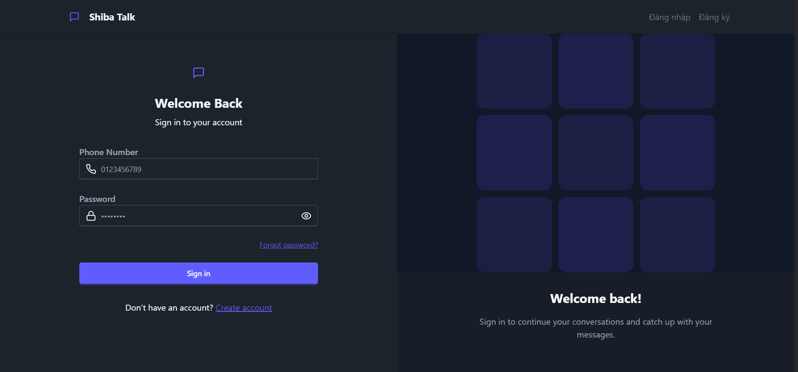
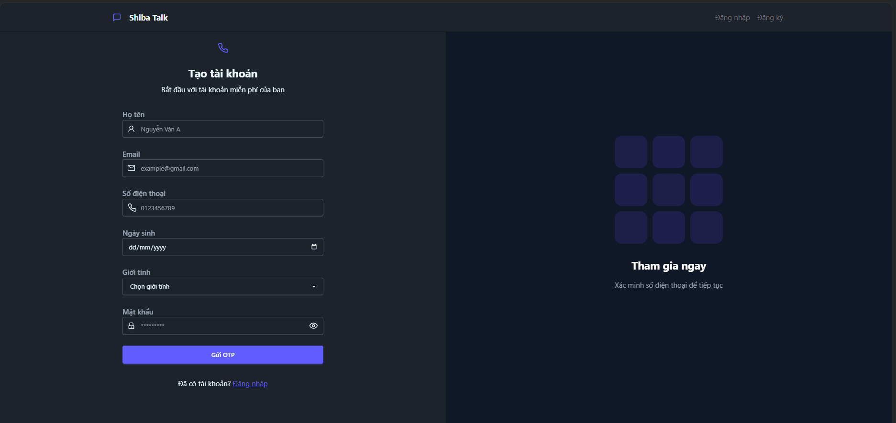
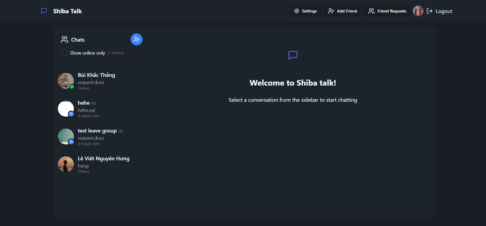
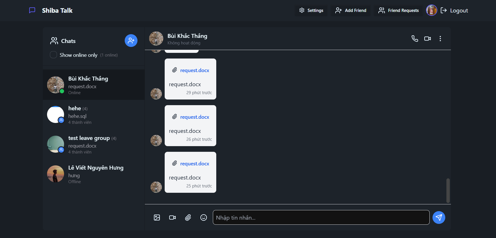
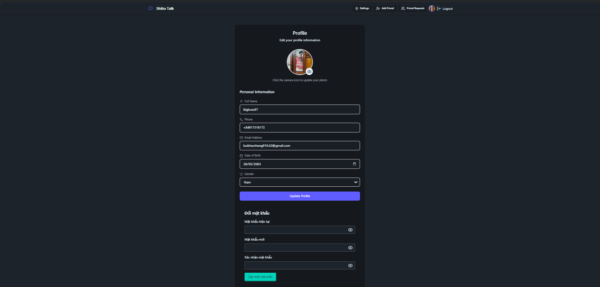
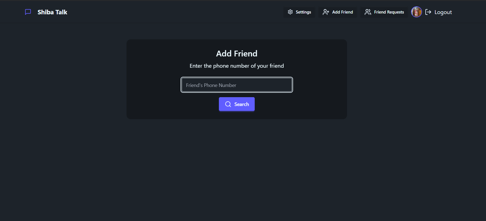
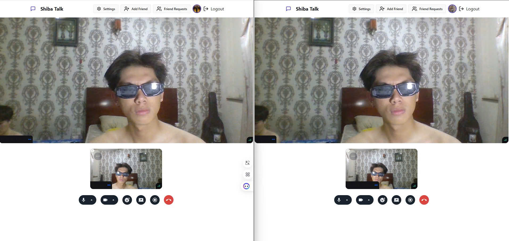

# ShibaTalk - Realtime Chat & Video Platform

**"Kết nối mọi khoảnh khắc – Trò chuyện không khoảng cách."**  
Một ứng dụng nhắn tin và gọi video thời gian thực với giao diện hiện đại, bảo mật cao và trải nghiệm mượt mà.

## 🌟 Tổng quan
ShibaTalk là ứng dụng chat và gọi video được xây dựng trên nền tảng MERN, tích hợp Socket.IO cho nhắn tin thời gian thực và WebRTC cho gọi video. Dự án hỗ trợ triển khai dễ dàng với Docker và tối ưu cho cả môi trường phát triển lẫn sản xuất.

## 🚀 Tính năng nổi bật
- ✨ Đăng ký/đăng nhập với xác thực JWT và OTP qua Twilio  
- 💬 Chat cá nhân và nhóm thời gian thực với Socket.IO  
- 📸 Tải ảnh đại diện với Cloudinary  
- 🎥 Gọi video nhóm sử dụng WebRTC  
- 🧾 Tìm kiếm bạn bè, quản lý nhóm, chỉnh sửa thông tin cá nhân  
- 🌐 Giao diện responsive, tối giản và thân thiện  

## 🧱 Tech Stack

| Layer            | Công nghệ sử dụng                      |
|-------------------|---------------------------------------|
| Frontend         | ReactJS, TailwindCSS, Zustand, Vite    |
| Backend          | ExpressJS, MongoDB Atlas, Socket.IO    |
| Auth             | JWT, bcrypt, cookie-parser, Twilio(OTP)|
| Realtime         | Socket.IO, WebRTC                      |
| Media            | Cloudinary, Multer                     |
| DevOps           | Docker, Docker Compose, Nodemon        |

```plaintext
📁 Cấu trúc thư mục

ShibaTalk/
├── backend/
│   ├── src/
│   │   ├── config/
│   │   ├── controllers/
│   │   ├── middleware/
│   │   ├── models/
│   │   ├── routes/
│   │   ├── services/
│   │   └── index.js
│   └── frontend/
│       ├── src/
│       │   ├── assets/
│       │   ├── components/
│       │   ├── constants/
│       │   ├── lib/
│       │   ├── pages/
│       │   ├── store/
│       │   ├── App.jsx
│       │   └── main.jsx
│       └── demo/
├── Dockerfile
├── docker-compose.dev.yml
├── docker-compose.prod.yml
└── README.md
```

## 🖼️ Giao diện Demo
Dưới đây là các hình ảnh minh họa giao diện của ứng dụng:

### 🏠 Đăng nhập


### 🏠 Đăng ký


### 🏠 Trang chủ


### 🏠 Giao diện nhắn tin


### 🏠 Thông tin người dùng


### 🏠 Tìm kiếm bạn bè


### 🏠 Cuộc gọi


## ⚙️ Hướng dẫn cài đặt & chạy

### ✅ 1. Clone và cấu hình môi trường
```bash
git clone https://github.com/Hungdacam/ChatApp_G1
cd ChatApp_G1
```

Tạo file `.env` trong thư mục `backend/`:
```
# Database
MONGODB_URI=mongodb://localhost:27017/your_database

# JWT
JWT_SECRET=your_super_secret_jwt_key_here

# AWS S3
REGION=ap-southeast-1
ACCESS_KEY_ID=your_aws_access_key_id
SECRET_ACCESS_KEY=your_aws_secret_access_key

# Cloudinary
CLOUDINARY_CLOUD_NAME=your_cloudinary_cloud_name
CLOUDINARY_API_KEY=your_cloudinary_api_key
CLOUDINARY_API_SECRET=your_cloudinary_api_secret

# Twilio
TWILIO_ACCOUNT_SID=your_twilio_account_sid
TWILIO_AUTH_TOKEN=your_twilio_auth_token
TWILIO_SERVICE_SID=your_twilio_service_sid

# Environment
NODE_ENV=production
```

### ✅ 2. Chạy ở chế độ Development
```bash
docker-compose -f docker-compose.dev.yml up --build
```

### ✅ 3. Truy cập ứng dụng
- 🌐 Frontend: http://localhost:5173  
- ⚙️ Backend API: http://localhost:3000  

### 🧪 Lệnh thủ công nếu không dùng Docker
```bash
# Backend
cd backend
npm install
npm run dev

# Frontend
cd frontend
npm install
npm run dev
```

### 📦 Build cho production
```bash
docker-compose -f docker-compose.prod.yml up --build
```

⚠️ Đảm bảo cập nhật `.env` phù hợp và set `NODE_ENV=production`.

## 📌 Ghi chú
- Kết nối Mongo sử dụng MongoDB Atlas  
- Gọi video sử dụng WebRTC, cần cấu hình token  
- Giao diện sử dụng TailwindCSS kết hợp DaisyUI  

## 👨‍💻 Tác giả
- Hungdacam 
- 🔗 GitHub: https://github.com/Hungdacam  

## 🌈 Happy Connecting!
- 💬 "Mỗi tin nhắn là một câu chuyện!"  
<<<<<<< HEAD
- 🚀 "Code sạch, kết nối mượt!"
=======
- 🚀 "Code sạch, kết nối mượt!"
>>>>>>> 6bfc9e594f2238d6f3b118e163ed14d8841ca8e8
